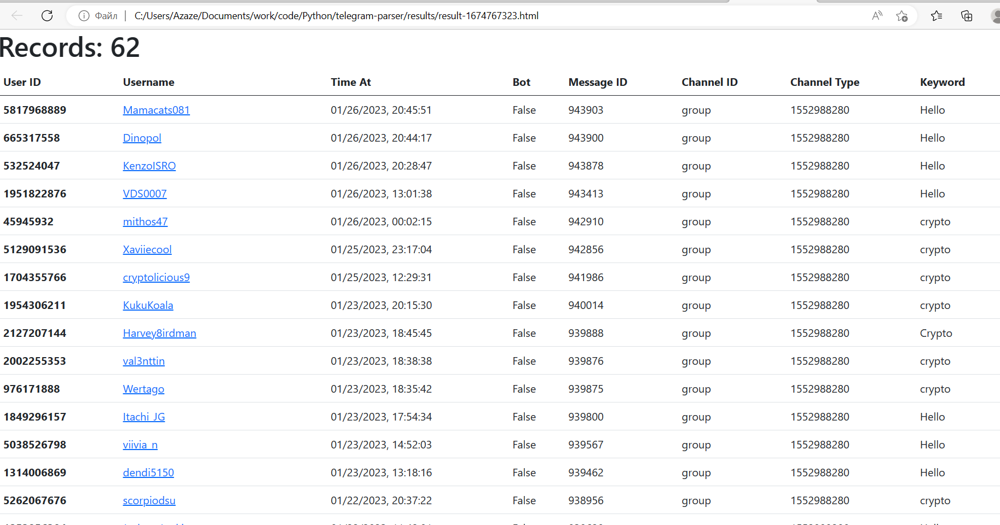

# Telegram-Keywords-Parser
* The script has been tested on version 3.7
***
# Installation:
```console
git clone https://github.com/Normalizex/telegram-keywords-parser

pip install -r requirements.txt
```
- requirements:
    - beautifulsoup4
    - Telethon
***
# Usage:
These example values won't work. You must get your own api_id and
api_hash from https://my.telegram.org, under API Development.

- ENV Arguments:
    `API_ID=string`
    `API_HASH=string`
    `KEYWORDS=keyword1,keyword2`
```console
#API_ID and API_HASH here: https://my.telegram.org

python main.py

[INPUT] Api ID =>10923443
[INPUT] Api Hash =>7361e8795bf4563f453e3e30dbce8249
[INPUT] Enter keywords (separated by spaces) =>crypto,info,data

#Arguments by env
KEYWORDS=crypto,info,data API_ID=10923443 API_HASH=7361e8795bf4563f453e3e30dbce8249 python main.py

#only on first launch or on another account
Please enter your phone (or bot token): [your number]
Please enter the code you received: [code]#paste code from telegram notify service (in client)
Signed in successfully as [username]

#done
[INFO] [1 of 571] | [GROUP]: ... | OutFile: results/result-1674766603.html
[RESULT] Saved as: results/result-1674766603.html
````
***
# Preview
* results/result-1674766603.html
